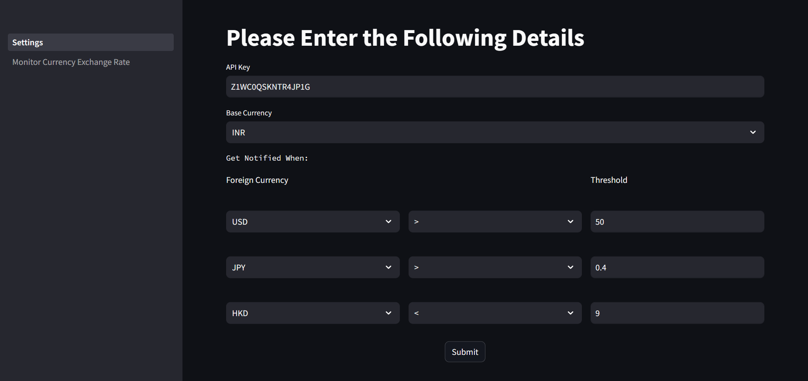
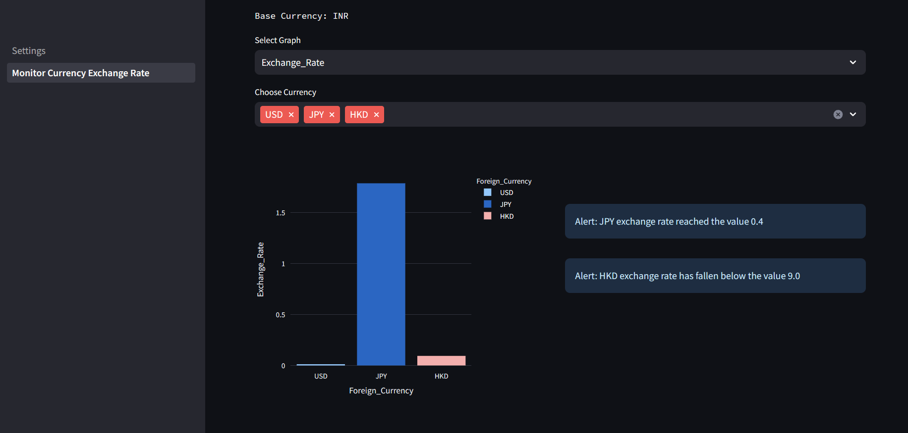

# Currency Exchange Monitor and Alert Agent

The Currency Exchange Monitor & Alert Agent is a tool built using the Fetch.ai's uAgent library. It provides real-time tracking and alert functionality for different currency exchange rates. Users can set their base currency, select one or more foreign currencies to monitor, and set thresholds for alerts.

Link to uAgent Library: 
- [uAgents Github Repository](https://github.com/fetchai/uAgents)
- [uAgent Documentation](https://fetch.ai/docs)
- [uAgent Examples](https://github.com/fetchai/uAgents-examples)

| Features   | Description  |
| ------------- | ------------- |
|  Currency Selection  | Choose your base currency and multiple foreign currencies for monitoring.  |
| Real-time Updates  |Connects to a currency exchange API to fetch current rates. |
| Custom Alerts  |Set custom thresholds for exchange rates and receive notifications when these thresholds are crossed.  |

## Installation
To clone the repository, run the following:
```bash
git clone https://github.com/mehak1309/currency-exchange-monitor
```
To install the package, run the follwing command:
```bash
pip install -r requirments.txt
```
To run the application, use the following commands:
```bash
python ./src/ main.py
python -m streamlit run settings.py
```
Generate your API key using this link:
[Create API Key](https://www.alphavantage.co/support/#api-key)

Please fill the required details in the website above to receive your API key.

## Package Dependencies

1. **Fetch.ai's uAgent Library**

    ```bash
    pip install uagent
    ```
2. **Streamlit**
   
    ```bash
    pip install streamlit
    ```
3. **Playsound**
   
    ```bash
    pip install playsound
    ```
4. **Pandas**
   
    ```bash
    pip install pandas
    ```
5. **Plotly**

    ```bash
    pip install plotly
    ```

These dependencies should be saved in the `requirements.txt` file, making it easier to set up the project. When setting up the project, you can simply run the following command in Step 2 to install all dependencies.

## Getting Started

### 1. Navigate to the Settings Page

Here, you can provide essential information for the currencies you wish to monitor:

- Input your API key.
- Specify the base currency.
- Define the foreign currency.
- Set your desired threshold.
- Complete the process by clicking the submit button.

### 2. Navigate to the Currency Monitor Page
When you navigate to the Currency Monitor Page, you'll encounter a dynamic bar chart. You have the flexibility to choose the graph view, whether for frequency or exchange rates, for the foreign currencies you selected earlier. Additionally, you can customize the foreign currencies displayed. The graph updates in real-time, providing you with the most current data.



On the right-hand side, you'll find alert notifications accompanied by sound cues. These alerts promptly notify you when the foreign currencies either surpass or dip below the threshold values set by the user.



## Database

This project relies on two essential datasets in CSV format:

- **currency_codes.csv:** This dataset comprises three-letter currency codes, enhancing the frontend user experience by providing easy access to currency information.

-  **user_data.csv:** Within this dataset, you'll find the information entered by users in forms, encompassing details related to foreign countries, thresholds, and more. It plays a crucial role in shaping the user experience and functionality of the application.

## Meta
Mehak Singal – 21f1006390@ds.study.iitm.ac.in

Nidhish Kumar - 21f1003758@ds.study.iitm.ac.in 

Garima Sikka - 21f1005923@ds.study.iitm.ac.in

Mohammed Samir - abutech8801@gmail.com

Distributed under the MIT license. See ``LICENSE`` for more information.


